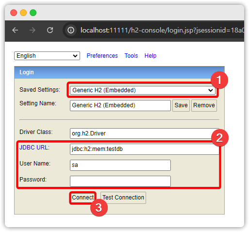

# 📌 사용하는 핵심 Dependency

> 참고: `spring-boot-dependencies BOM (ver.3.3.0)` 을 사용해서 버전을 관리합니다

- spring-webmvc
- thymeleaf
- spring-data-jdbc
- postgresql

<br><br>

# 📌 실행 전 주의할 사항들

## 1. JDBC 설정
placeholder.properties 에 JDBC 설정값들을 넣은 상태입니다. <br/>
자신의 상태에 맞게 편집해주시기 바랍니다!

<br>

## 2. spring boot 3 호환 Java, Tomcat version

 `spring-boot-dependencies BOM (ver.3.3.0)` 을 사용하기 때문에,<br>
 이에 호환되는 Java, Tomcat 버전을 사용해야 합니다.<br>
`Java` 는 `ver.17` 이상이면 되고, 톰캣은  `ver.10.1.x` 을 사용해야 합니다.<br>
이 프로젝트에서는 `Java 21` 와 `tomcat 10.1.23` 을 사용했습니다.<br/>
실습하시려는 분들 모두 버전 유의해서 프로젝트를 구동하시기 바랍니다.

<br><br>

# 📌  pom.xml 버전 관리
사용되는 모든 의존성 라이브러리들은 spring-boot 에서 제공하는 BOM 을 사용합니다.<br/>
수동적인 버전 기입은 추후에 CVE 문제를 고치는데 시간이 많이 걸릴듯하여 BOM 을 사용했습니다.<br/>
여기서 사용되는 BOM 은 spring-boot 3.3.0 에서 사용되는 것과 동일한 BOM 입니다.<br/>


<br><br>

# 📌 how to reload thymeleaf html

개발을 하면서 빠르게 타임리프 html 변경하고 바로 적용해서 봐야됩니다.<br>
이럴 때는 아래와 같이 하면 됩니다. 단! 인텔리제이를 사용하는 한해서 가능한 방법입니다.

<br>

## 1. SpringResourceTemplateResolver 빈 설정에서 cacheable=false 설정

```java
@Bean
public SpringResourceTemplateResolver templateResolver() {
    SpringResourceTemplateResolver resolver = new SpringResourceTemplateResolver();
    resolver.setPrefix("/WEB-INF/templates/");
    resolver.setSuffix(".html");
    resolver.setCacheable(false); // <== 이 코드를 추가합니다.
    return resolver;
}
```
위의 설정은 [WebConfiguration.java](src/main/java/coding/toast/springweblegacy/config/web/WebConfiguration.java) 에서 확인할 수 있습니다.


<br>

## 2. 인텔리제이 HotSwap 기능 사용

`디버깅 모드` 로 톰캣을 구동합니다.<br>
이후에 `ctrl + F10` 을 누르면 아래 그림과 같은 팝업창이 뜨는데<br>
`Update resources` 를 선택하고 `OK` 를 클릭합니다.<br>
이후에 다시 변경한 `html` 이 보이는 페이지를 열면 정상적으로 반영된 것을 확인할 수 있습니다.<br>


<br>

## 테스트 화면:


> 재차 말씀드리자만 "디버깅 모드" 로 톰캣을 실행해야 합니다! 꼭! 잊지마세요!


<br><br>

# 📌 how to login h2 console

톰캣을 구동 시키고 http://localhost:11111/h2-console/ 에 접속합니다.\
그러면 아래와 같은 콘솔창이 보입니다.



1. `Saved Settings`: `Generic H2 (Embedded)` 선택
2. 접속 정보를 입력합니다.
   1. `JDBC URL` : `jdbc:h2:mem:testdb`
   2. `User Name` : `sa`
   3. `Password` : (빈 문자열)
3. `Connect` 버튼을 클릭합니다.

<br>

정상적으로 로그인이 도면 아래와 같이 화면이 뜹니다.


